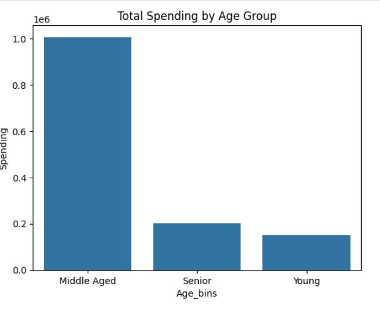
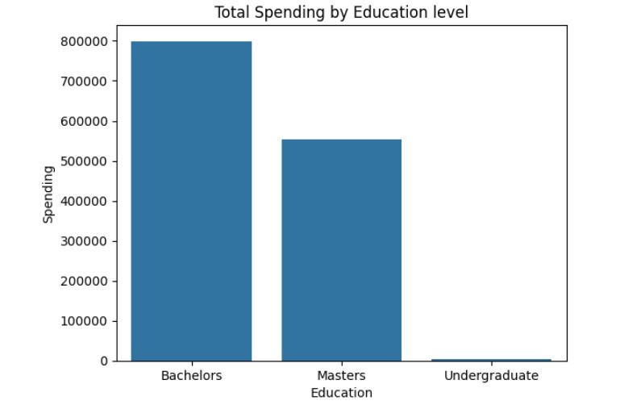
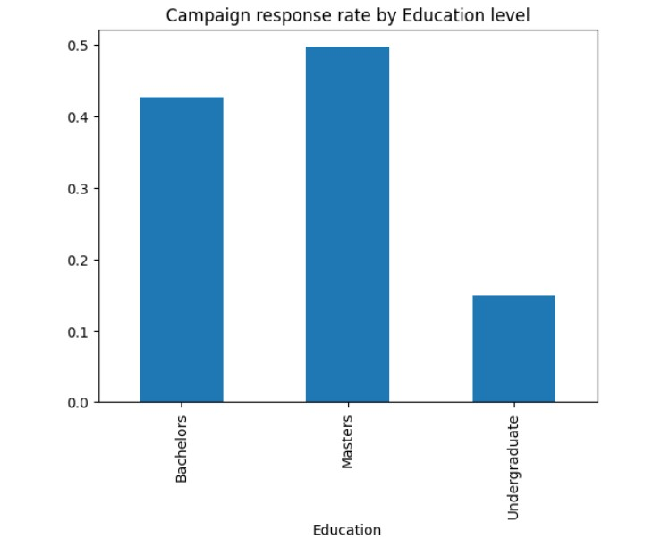

# 📊 MarketLens – Customer Demographics & Campaign Insights  

## 🧠 Project by: Rohit Sharma

---

## 📌 Project Description  

This project analyzes customer demographics, lifestyle, and past purchases to understand their likelihood of responding to marketing campaigns. The goal is to uncover actionable insights that can help optimize sales funnels and improve marketing effectiveness.  

---

## 🎯 Problem Statement  

Businesses often struggle to maximize campaign efficiency due to varied customer behaviors. This project aims to:  
- Understand how age, lifestyle, and spending affect campaign responsiveness.  
- Identify high-value and low-engagement customer segments.  
- Provide insights to improve campaign design and overall ROI.  

---

## 📖 Table of Contents  

1. [Project Overview](#project-overview)  
2. [Data Understanding](#data-understanding)  
3. [Data Cleaning](#data-cleaning)  
4. [Exploratory Data Analysis (EDA)](#eda)  
5. [Insights Derived](#insights-derived)  
6. [Recommendations](#recommendations)  
7. [Challenges Faced](#challenges-faced)  
8. [Future Scope](#future-scope)  
9. [Final Outcome](#final-outcome)  
10. [SQL Analysis File](#sql-analysis-file)  

---

## 🧩 Project Overview  

We analyzed customer data with a focus on:  
- Demographic segmentation by age, marital status, and income.  
- Lifestyle and purchase behavior patterns.  
- Responsiveness across different marketing campaigns.  

---

## 🧾 Data Understanding  

- Dataset includes fields such as:  
  - Age, marital status, profession, income level.  
  - Past purchase data (spending habits).  
  - Campaign responsiveness.  
- Target variable: response to marketing campaigns.  

---

## 🧼 Data Cleaning  

- Removed missing and duplicate entries.  
- Standardized categorical values (e.g., marital status, profession).  
- Created derived fields such as **age groups** (e.g., Young, Middle-aged).  
- Prepared data for SQL and visualization analysis.  

---

## 📊 EDA  

### 👤📊 Spending by Age Group  
 

### 📈 Spending by Education Level 
  

### 🎯 Campaign Response Rate by Education Level  
  

---

## 📍 Insights Derived  

1. **Customer Segmentation**  
   - Middle-aged customers (40–60), especially married professionals, spend the most and show the highest campaign responsiveness.  
   - Customers under 30 have the lowest engagement, highlighting the need for tailored strategies.  

2. **Campaign Effectiveness**  
   - Campaign #4 consistently underperformed, even among high-income groups → indicating message fatigue or poor targeting.  

---

## 💡 Recommendations  

1. **Revamp Campaign #4**  
   - Redesign messaging and targeting to improve relevance.  

2. **Loyalty Incentives for Low-Spenders**  
   - Offer bundled deals or loyalty rewards to younger, low-spending customers.  

3. **Segmentation Strategy**  
   - Focus more budget on middle-aged professionals while experimenting with engagement strategies for younger customers.  

---

## ⚠️ Challenges Faced  

- Balancing multiple demographic factors in analysis.  
- Low responsiveness data for certain campaigns limited deeper insights.  
- Ensuring clean, structured input for SQL analysis.  

---

## 🚀 Future Scope  

- Build predictive models for campaign success using machine learning.  
- Introduce real-time personalization strategies.  
- Expand analysis with multi-channel marketing data.  

---

## ✅ Final Outcome  

This project highlighted the importance of customer segmentation and campaign design. By focusing on high-value demographics and optimizing underperforming campaigns, businesses can improve ROI and customer lifetime value.  

---

## 🗂️ SQL Analysis File  

📄 [`SQL Analysis File.sql`](Analysis_with_SQL.sql)

---
